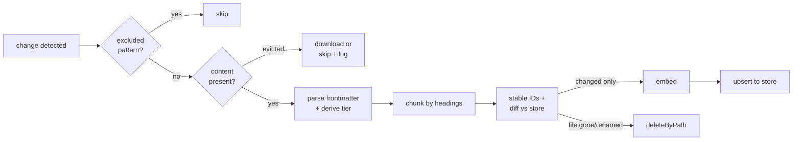
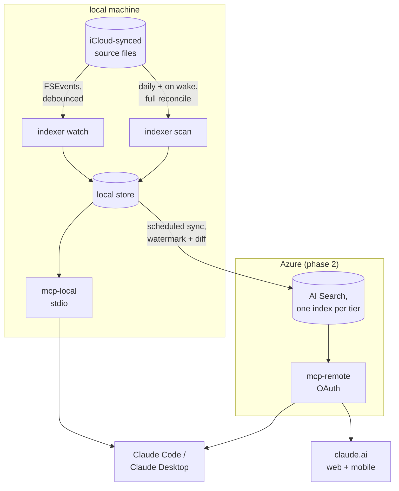

# RAG Toolkit Design (Draft)

Status: draft, pre-implementation. This document describes the intended shape
of the `packages/rag/*` workspace: how storage moves from local to cloud, how
ingestion from an iCloud-synced source works, and what triggers indexing.

The first source is an Obsidian vault synced through iCloud Drive. The design
keeps the source-specific parts (vault layout, frontmatter) in one adapter so
later sources (wiki exports, file shares, SaaS APIs) reuse the same pipeline.

## Package Layout

Three packages: all business logic in one, plus one runtime-definition
package per target (local machine, Azure).

```text
packages/rag/
  core/   document model, chunking, stable IDs, store implementations
          (local + cloud), embeddings client, sync logic, MCP tool
          handlers. Ships the runnable surfaces as bin entries:
            rag-indexer   ingestion CLI: scan/watch a source (phase 1)
            rag-mcp       stdio MCP server over the local store (phase 1)
            rag-sync      local → cloud upsert job (phase 2)
            rag-server    HTTP MCP server with OAuth, cloud-hosted (phase 2)
  local/  local runtime definition: persistent storage path convention
          for the embedded store's data directory, launchd definitions
          for the watcher and scheduled scan, local config. No Docker —
          see "Local runtime is native" below. Not published to npm.
  az/     deployment automation: IaC (Bicep/azd), Container Apps deploy,
          Entra ID app registration, Key Vault seeding (phase 2). Not
          published to npm.
```

**Local runtime is native, not containerised (decided).** The local store is
an embedded library plus a data directory: there is no database process to
put in a container. The ingestion side must stay native regardless: the
watcher depends on macOS FSEvents and iCloud file materialization, and both
are unreliable through Docker bind mounts. Containers appear in this design
only where they earn their place: the cloud-hosted `rag-server` (phase 2).

The names `indexer`, `sync`, `mcp-local`, and `mcp-remote` used below refer to
these modules/bins inside `core`, not separate packages. The indexer writes to
a store; the MCP servers read from one; sync copies between two: nothing else
couples them, so any module can be split into its own package later without
touching the others. Known trade-off of the single package: the cloud
container inherits local-only native dependencies (the embedded vector DB);
accepted at this scale, revisit if the image size bites.

## Document Model

One schema, used by every store implementation:

| Field          | Type      | Notes                                                                                                                      |
| -------------- | --------- | -------------------------------------------------------------------------------------------------------------------------- |
| `id`           | string    | Stable: hash of `source + relative path + heading path + chunk ordinal`. Same input → same ID, so re-indexing is an upsert |
| `source`       | string    | e.g. `obsidian`, `files`, `confluence`                                                                                     |
| `tier`         | enum      | `shared-business` \| `private-business` \| `private`, derived at ingestion, enforced at the MCP server                     |
| `path`         | string    | Source-relative path or URL                                                                                                |
| `heading_path` | string    | `Note title › H2 › H3`: keeps a chunk's context visible in results                                                         |
| `chunk_text`   | string    | The retrievable content                                                                                                    |
| `embedding`    | vector    | One embedding model across local and cloud (see below)                                                                     |
| `metadata`     | object    | Source-specific: frontmatter fields, tags, status                                                                          |
| `modified_at`  | timestamp | Source file mtime: drives incremental indexing and sync                                                                    |

**One embedding model from day one: Voyage AI (decided: see Decisions).**
The local index uses the same embedding API that the cloud index will use.
Vectors from different models are not comparable, so a local-only model would
force a full re-embed at migration. Consequence worth stating plainly: even in
the "local" phase, chunk text transits the Voyage API.

## Storage: Local Now, Cloud Later

`core` defines a small store interface; each phase provides an implementation:

```text
interface ChunkStore
  upsert(chunks)            // insert or replace by id
  deleteByPath(source, path) // remove all chunks for a gone/renamed file
  search(query, filters)     // hybrid: vector + keyword, filtered by
                             // tier/source/metadata
  listPaths(source)          // for reconciliation
```

|                  | Phase 1: local                                                    | Phase 2: cloud                                                               |
| ---------------- | ----------------------------------------------------------------- | ---------------------------------------------------------------------------- |
| Store            | LanceDB: embedded, single data directory (decided; see Decisions) | Azure AI Search, one index per tier                                          |
| Lives            | On the machine that owns the source files                         | Azure, private endpoints, encryption at rest                                 |
| Access           | Local stdio MCP server (Claude Code, Claude Desktop)              | Remote MCP server behind Entra ID OAuth (claude.ai everywhere + Claude Code) |
| Tier enforcement | Filter in the store query (single user, low stakes)               | Index-level separation; the server maps identity → allowed indexes           |
| Cost             | None beyond embedding calls                                       | Search + hosting + egress                                                    |

**The MCP tool contract is identical in both phases** (`search`,
`get_document`, `list_recent`). Migrating means pointing the tools at a
different store, not changing how anything is queried.

### Local → Cloud Sync (Phase 2)

`sync` treats the local store as the source of truth and the cloud index as a
replica:

1. Read local chunks where `modified_at` > last sync watermark → upsert to the
   tier's cloud index.
2. Diff `listPaths` local vs cloud → delete cloud chunks whose path no longer
   exists locally (handles renames and deletions; stable IDs make everything
   else an in-place upsert).
3. Advance the watermark only after both steps succeed.

Because IDs are deterministic, sync is idempotent: re-running after a partial
failure repairs rather than duplicates. Sync runs scheduled (see Triggers).
The cloud replica tolerates minutes of lag; it serves knowledge, not task
state.

### One Indexer, Many Readers

A second machine does not get a second index. The syncing vault is the source
of truth and each store is a _derived cache_ of it, so two stores means two
caches of the same thing and a divergence to arbitrate. There is deliberately
**no store-to-store sync** at this layer.

The shape that follows: one always-on host indexes and serves the index
read-only over MCP on a private network interface; every other machine
registers that endpoint and holds no store at all.

What this buys, and what it costs:

- **Fewer standing grants.** A machine that does not index needs no
  filesystem grant for the vault (see Security Boundaries).
- **Embedding cost falls to one pass.** Two indexers embed every chunk twice,
  for identical vectors.
- **Offline search disappears.** Not degraded — absent. A reader that cannot
  reach the serving host has no search. This is the trade, and it is only
  worth taking where the network reaches almost everywhere.

Parity between two derived stores stops being measurable, because there is no
second store to compare. If an index is ever put back on a reader, the answer
is still not a sync job: it is two independent derivations from the same
vault, and parity becomes something to measure again.

## Ingestion from iCloud

iCloud Drive is a syncing filesystem, not a plain folder. Three behaviours
shape the indexer:

- **Dataless files.** iCloud may evict a file's content, leaving a stub until
  something reads it. The indexer must detect evicted files and either trigger
  a download or skip-and-log: never index an empty body over a previously
  good chunk.
- **Conflict and backup copies.** Sync conflicts create sibling files
  (`Note 2.md`, `Note (conflict).md`); tooling leaves `.bak` files. These are
  excluded by pattern, or the index fills with near-duplicates that poison
  retrieval. **The counter must be bounded.** An unbounded run of digits also
  matches a trailing year, so any note whose title ends in one — a yearly
  budget, a log named for its year, or any file following a
  `<topic>, <Day> <D> <Mon> <YYYY>` convention — reads as a phantom conflict
  copy and never reaches the index. Silently: an excluded file produces no
  error, so the only symptom is a search that should have hit and did not.
  Two digits covers real conflict copies; a conflict copy _of_ a dated file
  still ends in the counter, so it is still caught.
- **Burst writes.** Sync delivers many rapid change events for one logical
  edit. The watcher debounces (settle window of a few seconds) before
  re-indexing a file.

Pipeline per file:



The embed step runs only for chunks whose content hash changed: unchanged
chunks cost nothing on re-runs.

## Triggers: Scheduled Versus Real-Time

Two distinct trigger points exist: **source → local index** (ingestion) and
**local index → cloud** (sync). They have different freshness needs.

|                | Scheduled (launchd/cron)                            | Real-time (filesystem watch)                                           |
| -------------- | --------------------------------------------------- | ---------------------------------------------------------------------- |
| Freshness      | Minutes to hours stale                              | Seconds                                                                |
| Complexity     | Low: a CLI run on a timer                           | Higher: long-lived process, FSEvents/watcher, debounce, crash recovery |
| Failure mode   | Missed window → next run catches up                 | Watcher dies silently → index quietly drifts until noticed             |
| Missed changes | Impossible (every run is a full reconcile)          | Possible (events during downtime are lost)                             |
| Resource cost  | Burst at run time                                   | Small constant background cost                                         |
| iCloud fit     | Good: reconcile handles anything sync did meanwhile | Needs the debounce + eviction handling above                           |

**Chosen model: real-time watch with a scheduled reconcile as backstop, for
ingestion; scheduled only, for cloud sync.**

- **Ingestion** runs as a watcher (`indexer watch`) so a note saved mid-session
  is searchable moments later: that immediacy is the point of a personal
  index. A scheduled `indexer scan` (e.g. daily, and on machine wake) does a
  full reconcile, catching anything the watcher missed while dead and pruning
  chunks for deleted files. Either mode alone is weaker: watch-only drifts,
  schedule-only is stale.
- **Cloud sync** is scheduled (e.g. every 15–60 minutes). Nothing consuming
  the cloud replica needs second-level freshness, sync batches efficiently,
  and a timer is one less long-lived process to babysit. If a use case later
  needs faster propagation, the watcher can chain a sync run after quiet
  periods: an additive change, not a redesign.



## Installation and Qualification (IQ/OQ)

`packages/rag/local` automates setup and carries the qualification suite. The
vocabulary is deliberate: **IQ** proves the installation matches its
specification; **OQ** proves the installed system operates as intended. Both
produce timestamped report artefacts (pass/fail per check) written to the
storage directory under `qualification/`: the evidence is a file, not a
terminal scroll.

### Install Flow

```text
rag install
  1. create storage directory (embedded store data, config, qualification/)
  2. write config: source path, storage path, embedding provider, exclusions
  3. install + load launchd agents (watcher, scheduled scan)
  4. register the stdio MCP server with Claude Code
  5. run IQ                        ← automatic, part of install
  6. first scan (initial ingestion)
  7. run OQ in read-write mode     ← proof the pipeline works end to end
```

### IQ: Installation Qualification (Runs at Install, Re-Runnable)

Static and connectivity checks against the installed state:

| Check                                                       | Proves                                     |
| ----------------------------------------------------------- | ------------------------------------------ |
| Runtime version, bins resolvable (`rag-indexer`, `rag-mcp`) | The package is installed as specified      |
| Config exists and validates against schema                  | The system is configured, not just present |
| Storage directory exists, writable, expected layout         | The store has somewhere to live            |
| Source path exists and is readable                          | Ingestion has something to read            |
| Embedding endpoint reachable, credential accepted           | The one external dependency works          |
| launchd agents loaded                                       | The triggers exist                         |
| MCP registration present                                    | The serving side is wired to a client      |

IQ makes no writes beyond its own report. A failed check names the remediation.

### OQ: Operational Qualification (Runnable at Any Time)

Two modes, one command:

**Read-only** (`rag oq`): safe against a live system, any time:

- Store opens; chunk count > 0; newest `modified_at` within a freshness bound
- A fixed reference query returns results with all required fields inside a
  latency bound
- Negative: no chunks exist from excluded paths (templates, backups,
  conflict copies)
- Negative: a tier-filtered query returns nothing from outside that tier
- MCP round trip: spawn the stdio server, `tools/list`, one `search` call,
  well-formed response

**Read-write with cleanup** (`rag oq --rw`): the end-to-end proof, used
during first setup and after ingestion changes:

1. Write a fixture note containing a unique sentinel (UUID) into a dedicated
   fixture folder inside the watched source.
2. Wait for the watcher (or trigger a scan): proves the real trigger path.
3. Search for the sentinel: proves chunk → embed → store → retrieve.
4. Delete the fixture; re-scan; verify its chunks are gone: proves
   `deleteByPath` and that cleanup happened.
5. Cleanup runs in a finally-block: the fixture cannot outlive the run even
   on failure, and the sentinel makes any leftover uniquely findable.

The OQ report is the standing answer to "does it still work?" Re-run
read-only after any upgrade, re-run read-write after touching ingestion.

### Scheduled Maintenance

`rag maintain` compacts the store and then runs the read-only checks, writing
a `MAINT-*` report and exiting non-zero on failure. A launchd agent runs it
weekly, half an hour after the daily scan so the two never touch the store at
once.

It is **not** where the store is kept small — compaction already runs at the
end of every scan. It exists because nothing was _checking_. The store reached
29 GB and the only reason anyone noticed was an unrelated investigation; a
guard no schedule runs reports a problem after it has cost something.
Compacting again is cheap insurance for the case the scans have stopped, since
a dead watcher means no compaction either.

Its first run earned its place by finding a bug in one of the checks it runs:
index freshness sampled the first 500 of 607 paths and reported the newest of
that sample, showing an index 0.7 days old as 2.6 days stale. A freshness
answer has to consider every row, so the store now exposes `newestModifiedAt`
as a single query. The failure direction that matters is the opposite one: the
same sampling could have reported a genuinely stale index as fresh.

## Security Boundaries

- Tier is decided at ingestion (folder → tier rule per source) and enforced at
  the serving layer, never by prompt instructions.
- Phase 2 access: Entra ID OAuth on the remote MCP server; token identity maps
  to allowed tier indexes. Private-tier data is deferred to phase 2 for
  exactly this reason: it does not enter any index until the gate exists.
- Secrets (embedding API keys, search keys) come from the environment locally
  and Key Vault in Azure; nothing is stored in the index or the repo.
- The serving endpoint binds to one private interface, refused in code rather
  than by convention: a wildcard bind is rejected and the server does not
  start. It is the mistake that turns a private service into a network service
  while every functional test still passes.

### The Filesystem Grant, and Why the Interpreter Is Copied

A syncing vault sits behind the platform's file-access controls, and a process
started by the system's background job manager **does not inherit** the grant
held by the terminal a human runs commands in. So a scheduled indexer needs a
grant of its own.

Granting it to the shared language interpreter is much wider than it looks:
that binary is general-purpose, so the grant reaches every script any
background job ever runs under it. Instead the installer copies the
interpreter into its own storage directory and re-signs the copy ad-hoc,
giving it a code identity distinct from the original. The grant is then made
to one binary that runs one program.

Two things follow, and both have bitten:

- **Verify the identity, not the intent.** The copy and the original must
  present as different binaries to the access-control layer, or the grant
  covers both and nothing was gained.
- **"Loaded" is not "working".** A job manager reports a crash-looping agent
  as loaded indefinitely. A health check that asks whether an agent is loaded
  will pass while the agent has never once read the vault. Read the last exit
  status.

## Decisions

Settled 2026-08-09:

| Decision           | Choice        | Rationale and consequences                                                                                                                                                                                                                                                                                                                                    |
| ------------------ | ------------- | ------------------------------------------------------------------------------------------------------------------------------------------------------------------------------------------------------------------------------------------------------------------------------------------------------------------------------------------------------------- |
| Local store        | **LanceDB**   | Embedded TS API, hybrid vector + full-text search built in, no server process. Native binary dependency accepted. The `ChunkStore` interface keeps a later swap cheap if it disappoints on the real corpus                                                                                                                                                    |
| Embedding provider | **Voyage AI** | Retrieval quality and setup simplicity weighed over single-vendor alignment with Azure. Recorded consequence: Voyage is a data processor for every chunk it embeds, in all phases: phase-2 cloud ingestion calls Voyage from Azure, and private-tier content (including health data, when it joins) transits Voyage. Revisit per-tier if that posture changes |

Still open:

| Decision           | Options                                                | Settled by     |
| ------------------ | ------------------------------------------------------ | -------------- |
| Watcher runtime    | launchd agent vs on-demand from the MCP server process | Phase-1 spike  |
| Remote MCP hosting | Azure Container Apps (assumed) vs Functions            | Phase-2 design |
