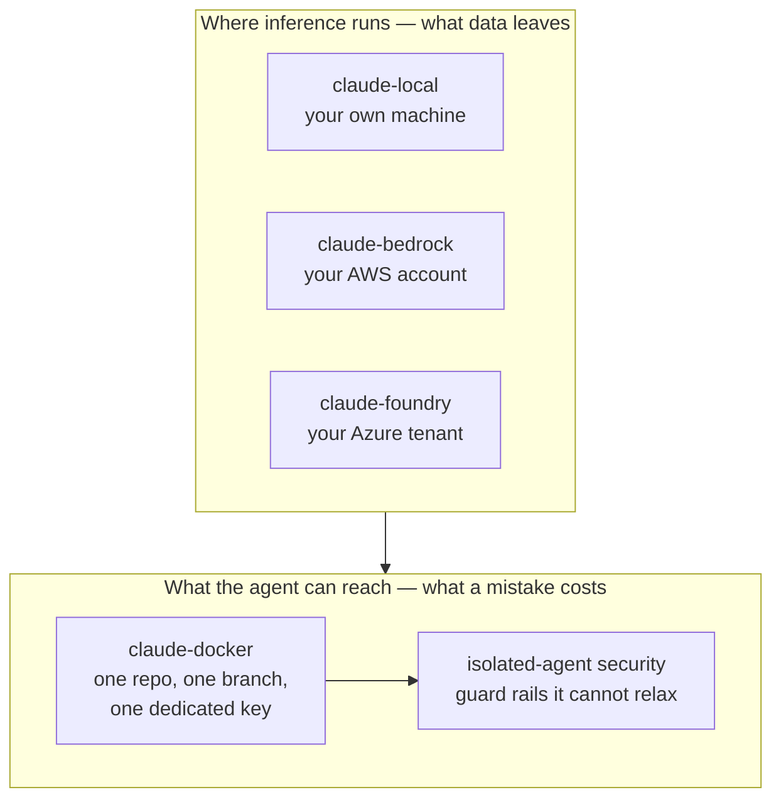
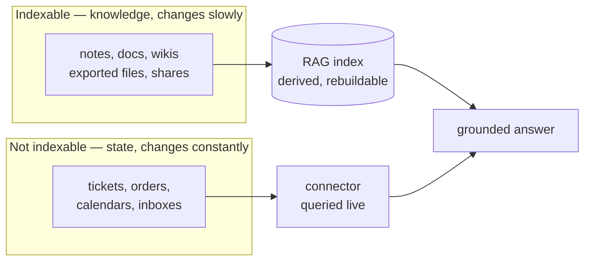
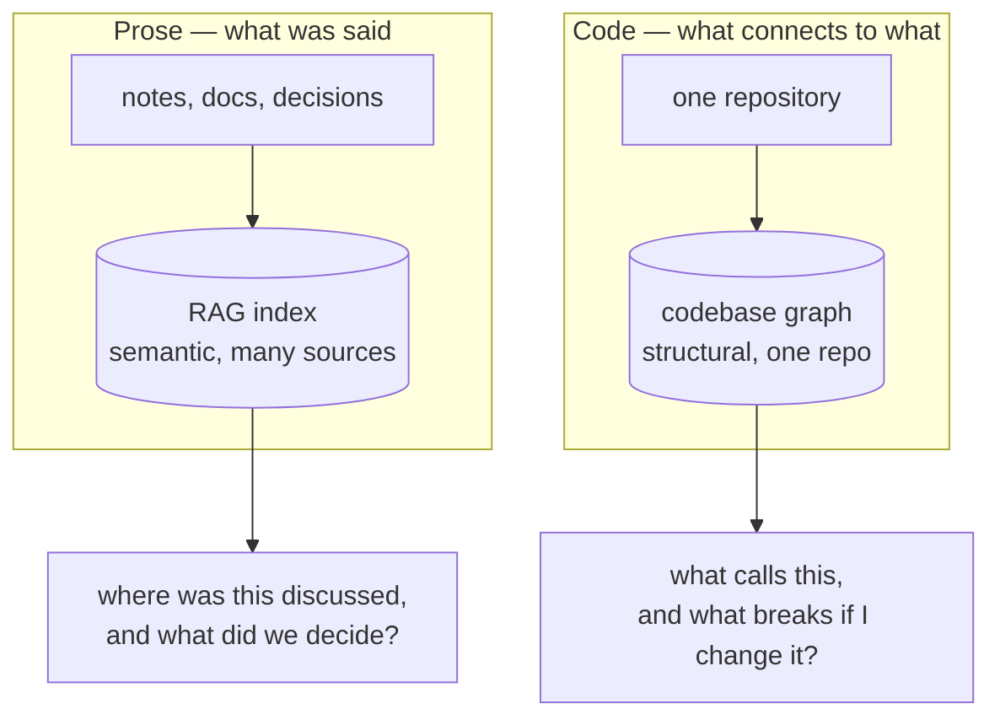

# Practices

Patterns and operating models for working with Claude, across projects. Prose,
not config: the _how_ and _why_ of a way of working. Enforcement lives in the
other areas (security, privacy, plugins); this folder explains the shape they
add up to.

## Agent Isolation

An agent is useful in proportion to what it can reach, and dangerous in the same
proportion. No single setting resolves that, so the answer is layers, each one
holding when the one above it fails. Further reading:
[defence in depth for agents](https://www.lekman.com/blog/ai-security-defence-in-depth-for-agents).

Two questions are independent, and confusing them is the usual mistake:

- **Where does inference run?** This decides what data leaves your control.
- **What can the agent reach?** This decides what a mistake, or an injected
  prompt, can actually do.

Running Claude in your own AWS account answers the first and nothing about the
second: the agent still has your laptop. Putting it in a container answers the
second and nothing about the first. Most setups need both.

- [local-models/](local-models/README.md): run Claude Code against a model on
  your own machine via LM Studio's Anthropic-compatible endpoint, for work that
  must not leave the laptop. Installed and driven by
  [@lekman/claude-local](../packages/claude-local/README.md).
- [bedrock/](bedrock/README.md): run Claude Code on AWS Bedrock and keep the SSO
  session alive with a `SessionStart` auto-login hook, so a session never fails
  part way through on an expired token.
- [foundry/](foundry/README.md): run Claude Code on Claude in Microsoft Foundry
  (Azure), where there is no setup wizard and nothing checks the configuration
  before the first request, so pinning models and checking the Azure session
  are yours to do. Driven by
  [@lekman/claude-foundry](../packages/claude-foundry/README.md).
- [isolated-container/](isolated-container/README.md): give the agent a
  container holding one repository, one branch, and one dedicated credential,
  then stop asking it for permission: the boundary covers what the prompt was
  protecting. Driven by
  [@lekman/claude-docker](../packages/claude-docker/README.md).
- [security/isolated/](../security/isolated/README.md): the guard rails an agent
  must not be able to relax on its own, whether or not it sits in a container.

## Retrieval

What an agent can look up shapes what it can answer. Retrieval-augmented
generation adds a derived, searchable layer over knowledge sources (a
BI/warehouse layer for AI, queried just-in-time) while live state stays
behind APIs and connectors.

The split is the useful part. Knowledge that changes slowly is worth indexing.
State that changes constantly is not, and belongs behind a live query.

- [rag/README.md](rag/README.md): the mental model (fed like a warehouse,
  queried like a search index); why transactional data does not fit; when a
  live connector beats a pipeline. Design for the implementation in
  [packages/rag/DESIGN.md](../packages/rag/DESIGN.md).

## Codebase Graphs

Retrieval makes prose searchable. The equivalent for code is structural: a graph
of files, symbols, layers and the relationships between them, so an agent gets a
map before it edits rather than grepping its way to one.

The two layers answer different questions, and neither replaces the other.

Building a graph reaches further than most tasks, so it lands on both axes
above. It summarises every file in scope, which decides where inference must
run, and it fans out across the whole repository, which decides whether it
belongs in a container.

- [Codebase Graphs](graphs/README.md): when a graph pays for itself, how to
  scope and run one without overspending, which parts of the output to
  distrust, and how the run combines with local models and the isolated
  container.

## Orchestration

Isolation decides what one agent may do. Orchestration decides how many there
are and who holds the plan. Both docs below split the same way: something that
holds context and never touches code, and something disposable and narrowly
scoped that does.

- [planning-handoff.md](planning-handoff.md): plan in Claude Desktop, implement
  in Claude Code on dedicated instances, and connect the two with committed
  day plans and briefs under `docs/handoff/`. The operating model behind the
  retired handoff plugin (day plans live in Obsidian now).
- [orchestrator-subagent.md](orchestrator-subagent.md): run agents continuously
  by splitting work between a planning orchestrator that never touches code and
  disposable, scoped subagents that do. The operating model behind
  [isolated-agent security](../security/isolated/README.md).

## An Agent-Operated Notes Vault

Where the working notes live and how an agent maintains them. Obsidian holds
the markdown; Claude Code runs inside the vault (via the ObsidiBot plugin)
and does the filing, the daily plan and the recurring documents. The value is
written conventions, not plugins: a frontmatter schema, one folder and one
dashboard group per client, and skills for anything written the same way
three times.

- [Obsidian as an Agent-Operated Workspace](obsidian/README.md): the full
  practice, from vault settings to conventions, the dashboard method, the
  agent layer underneath, and the cautions (iCloud races, secrets, client
  separation as a contractual matter).

## Observability

Isolation and orchestration decide what the agent may do and who holds the plan.
Neither tells you what it is doing right now. An agent you cannot see is one you
end up watching instead of working alongside.

- [observability/README.md](observability/README.md): notifications first, since
  knowing when to look is what makes watching optional. Three techniques by
  distance from the keyboard: built-in remote control, Pushover for long runs,
  and a local sound cue tuned so it means _look now_. Progress and access
  visibility are named but not yet built.
