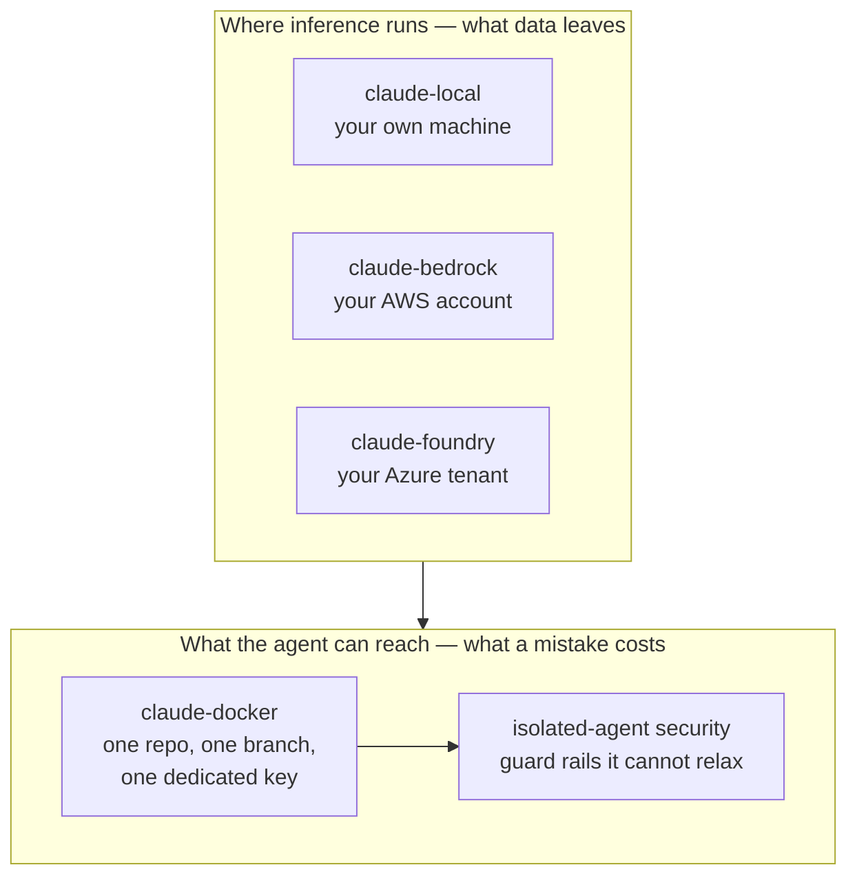

# Practices

Patterns and operating models for working with Claude, across projects. Prose,
not config: the _how_ and _why_ of a way of working. Enforcement lives in the
other areas (security, observability, plugins); this folder explains the shape
they add up to.

## Agent isolation

An agent is useful in proportion to what it can reach, and dangerous in the same
proportion. No single setting resolves that, so the answer is layers — each one
holding when the one above it fails. Further reading:
[defence in depth for agents](https://www.lekman.com/blog/ai-security-defence-in-depth-for-agents).

Two questions are independent, and confusing them is the usual mistake:

- **Where does inference run?** This decides what data leaves your control.
- **What can the agent reach?** This decides what a mistake, or an injected
  prompt, can actually do.

Running Claude in your own AWS account answers the first and nothing about the
second — the agent still has your laptop. Putting it in a container answers the
second and nothing about the first. Most setups need both.

- [local-models/](local-models/README.md): run Claude Code against a model on
  your own machine via LM Studio's Anthropic-compatible endpoint, for work that
  must not leave the laptop. Installed and driven by
  [@lekman/claude-local](../packages/claude-local/README.md).
- [bedrock/](bedrock/README.md): run Claude Code on AWS Bedrock and keep the SSO
  session alive with a `SessionStart` auto-login hook, so a session never fails
  part way through on an expired token.
- [foundry/](foundry/README.md): run Claude Code on Claude in Microsoft Foundry
  (Azure), where there is no setup wizard and nothing checks the configuration
  before the first request — so pinning models and checking the Azure session
  are yours to do. Driven by
  [@lekman/claude-foundry](../packages/claude-foundry/README.md).
- [isolated-container/](isolated-container/README.md): give the agent a
  container holding one repository, one branch, and one dedicated credential,
  then stop asking it for permission — the boundary covers what the prompt was
  protecting. Driven by
  [@lekman/claude-docker](../packages/claude-docker/README.md).
- [security/isolated/](../security/isolated/README.md): the guard rails an agent
  must not be able to relax on its own, whether or not it sits in a container.

## Orchestration

Isolation decides what one agent may do. Orchestration decides how many there
are and who holds the plan. Both docs below split the same way: something that
holds context and never touches code, and something disposable and narrowly
scoped that does.

- [planning-handoff.md](planning-handoff.md): plan in Claude Desktop, implement
  in Claude Code on dedicated instances, and connect the two with committed
  day plans and briefs under `docs/handoff/`. The operating model behind the
  [handoff plugin](../plugins/handoff/skills/plan-handoff/SKILL.md).
- [orchestrator-subagent.md](orchestrator-subagent.md): run agents continuously
  by splitting work between a planning orchestrator that never touches code and
  disposable, scoped subagents that do. The operating model behind
  [isolated-agent security](../security/isolated/README.md).
