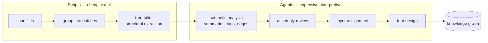

# Codebase Graphs

Turning a repository into a graph of files, symbols, layers and relationships,
so structure can be queried instead of grepped. This page covers when the
technique pays for itself, how to run it without overspending, and which parts
of the output to distrust.

The reader is someone deciding whether to build a graph of a repository they
own, and what to check before believing it.

## What a Codebase Graph Is

A graph analyser reads every file in scope and emits two things: **nodes**
(files, functions, classes, configs, documents) and **edges** (imports, calls,
contains, exports, tested_by, documents, configures). A second pass groups the
nodes into **layers**, and a third writes a **tour**: an ordered reading path
through the codebase for someone seeing it the first time.



The split matters more than it looks. File enumeration, import resolution and
syntax parsing are exact and cheap. Summaries, layer boundaries and teaching
order are judgement calls that need a model. Costs and failure modes differ on
each side of that line.

## When It Earns Its Keep

A graph is worth building when the repository is too large to hold in one
context window and you need something other than search to navigate it:
onboarding a new maintainer, planning a refactor across packages, or giving an
agent a map before it edits.

It is not worth building for a small repository, for code you already know, or
as a substitute for reading. The graph tells you what connects to what. It does
not tell you whether the code is correct.

Two properties limit it. The graph is a snapshot at one commit, so it drifts.
And the interpretive half is model output, which means parts of it are
confident and wrong.

## Where to Run the Analysis

Building a graph is the widest-reaching thing an agent does to a repository. It
reads every file in scope, sends a description of each one to a model, spawns a
dozen or more subagents, and installs a third-party toolchain to do it. The two
questions from [Practices](../README.md) both apply, and they are still
independent.

| Question                  | What the analysis does                                                                                      | What answers it                                                                                                       |
| ------------------------- | ----------------------------------------------------------------------------------------------------------- | --------------------------------------------------------------------------------------------------------------------- |
| Where does inference run? | Sends a summary of every file in scope to a model, so the shape of the codebase leaves your control         | [Local Models](../local-models/README.md), [Bedrock](../bedrock/README.md), [Microsoft Foundry](../foundry/README.md) |
| What can the agent reach? | Reads every file, writes into the repository, and runs a package install that executes native build scripts | [Isolated Container](../isolated-container/README.md), [Isolated Agent](../../security/isolated/README.md)            |

### Data Leaving: Pick the Inference Path First

A graph run is not a few file reads. Every file in scope is summarised, so the
structure, naming and intent of the codebase travel to wherever inference runs.
For client code or anything under a confidentiality obligation, that decides the
question before cost does.

Running the analysis against a local model with
[@lekman/claude-local](../../packages/claude-local/README.md) keeps the code on
the machine. The trade-off is real: summaries, layer boundaries and tour order
are the interpretive half of the pipeline, and a smaller model produces weaker
judgement on exactly those. The deterministic half is unaffected, because it is
tree-sitter and not a model at all.

Where the code may leave the laptop but not the organisation, run it on
[Bedrock](../bedrock/README.md) or [Microsoft Foundry](../foundry/README.md)
instead of a local model, and keep the stronger judgement.

### Blast Radius: Run It in a Container

Two parts of the run reach further than the task needs:

- **The toolchain install.** The plugin builds a native tree-sitter toolchain,
  and that package install executes build scripts from third-party packages. It
  is ordinary supply-chain exposure, and it runs on whatever machine you started
  from.
- **The fan-out.** The pipeline dispatches many subagents in parallel, each with
  file access across the repository. Reviewing what each one did is impractical
  once there are twenty of them.

Both are contained by running the analysis inside
[@lekman/claude-docker](../../packages/claude-docker/README.md): one repository,
one branch, one dedicated credential. The work suits a container better than
most tasks, because it is read-mostly and writes to exactly one directory. Copy
`.ua/` out when it finishes, or let the container push a branch.

Where the analysis runs outside a container, the guard rails in
[Isolated Agent](../../security/isolated/README.md) still apply, and the
`autoUpdate` hooks below are the specific thing to keep switched off.

### The Graph Itself Is a Disclosure Artefact

The output holds model-written descriptions of every file in scope: what each
module does, which parts are security boundaries, where the fragile logic sits.
That is a useful document and a briefing for anyone who should not have it.

Treat it with the same care as the code it describes. Keep it out of public
repositories, and out of shared ones unless the team has agreed to it. The
gitignore entries below are the minimum.

### How It Relates to Retrieval

A codebase graph and a [Retrieval (RAG)](../rag/README.md) index solve different
problems and do not replace each other. The graph is structural, built over code
in one repository, and answers "what connects to what". A retrieval index is
semantic, built over prose across many sources, and answers "where was this
discussed". Running both is reasonable. Feeding one into the other is not a
pattern worth reaching for yet.

## The Tool

[Understand Anything](https://github.com/Egonex-AI/Understand-Anything) is a
Claude Code plugin that implements the pipeline above. Install it from its own
marketplace:

```bash
claude plugin marketplace add Egonex-AI/Understand-Anything
claude plugin install understand-anything@understand-anything
```

It provides nine skills. `/understand` builds the graph, `/understand-dashboard`
serves it in a browser, and the rest query it: `understand-chat`,
`understand-explain`, `understand-diff`, `understand-onboard`,
`understand-domain`, `understand-knowledge`, `understand-figma`.

### Prerequisites

Node.js 22 or later and pnpm 10 or later. The plugin builds a TypeScript core
package on first run and will not proceed without pnpm. If pnpm is not
installed, `npx --yes pnpm@10` works as a substitute in every command the skill
issues.

### The Hooks It Ships

The plugin installs two hooks. Both stay dormant unless a project has a `.ua/`
directory with `"autoUpdate": true` in its `config.json`:

- A `PostToolUse` hook on Bash. It fires only for commands matching
  `git commit`, `git merge`, `git cherry-pick` or `git rebase`.
- A `SessionStart` hook that compares the recorded commit hash against `HEAD`.

Neither writes files or runs commands. Both inject a prompt telling the agent to
refresh the graph, and both end that prompt with an instruction not to ask for
confirmation. Enabling `autoUpdate` therefore spends context and tokens on every
commit in that repository, silently. Leave it off unless the repository is one
where a stale graph would cause real harm.

## Scope Before You Run

Cost scales with file count, and the analysis phase dominates. Decide scope
first, because widening later is cheap and narrowing later wastes a run.

On a 285-file repository, scoping to the 162 files that hold runnable code cut
the work roughly in half: 23 batches, about 15 agent dispatches. The excluded
half was prose and configuration that would have added document nodes and little
structure.

Record the scope in `.ua/.understandignore` rather than passing `--exclude` on
the command line. The command-line flag applies only to a full rebuild, so an
incremental re-run silently ignores it. The ignore file is honoured by both.

### Keep the Output Out of Git

The graph is a generated artefact. A rebuild rewrites the whole file, so it
churns every diff, and its summaries are model-written descriptions of the code.
Add the data directories to a global ignore file so no repository picks them up
by accident:

```gitignore
.ua/
.understand-anything/
```

## Run the Deterministic Parts Yourself

The skill instructs each analysis agent to run the tree-sitter extraction script
for its own batch. Running all extractions directly instead, before dispatching
any agent, removes that work from the agents entirely.

On a 23-batch run the extractions completed in seconds and reported per-batch
file counts, which surfaced a parsing gap immediately: one file had no parser
and would otherwise have vanished without a node. The agents then started at the
semantic step with results already on disk.

The general rule: when a workflow hands a deterministic script to a model, run
the script yourself and give the model its output. You pay less, you fail
faster, and the failure is legible.

## What to Verify

Three defect classes appeared on a single run. Two are properties of the
technique rather than accidents, so expect them again.

### Re-Exports Break Relationship Targeting

The analyser resolves relationships against the path it imported from, not the
path where the symbol is defined. In a codebase that re-exports through barrel
`index.ts` files, those are different paths.

The effect is severe. Of 107 symbol imports mediated by a barrel, only four
produced a relationship edge. Around 51 call edges were missing outright. A
missing edge does not dangle, so no automatic validation catches it: the graph
looks complete and is half empty.

The same fault corrupted test coverage. Eleven of 15 `tested_by` edges named a
barrel as the file under test, which hides what is actually covered. Retargeting
them to definition sites moved coverage onto 17 real modules.

If the codebase uses barrels, check the call-edge count against the import count
before trusting the graph. A review pass can repair it, but only if it is told
to look.

### A Scoped Graph Invents Findings at Its Own Boundary

Anything the excluded half legitimately references looks broken to an agent that
cannot see it. On one run an agent reported a README as stale for naming a file
that does exist, just outside the scope.

Treat every "missing target" claim that points outside the scope as an artefact
until checked. In the same run, eight of ten dropped edges were this, and only
two were real defects.

### Hard Limits Cause Silent Deletions

The analyser splits its output when a batch exceeds a fixed edge count. One
batch came in one edge over the limit and deleted an edge rather than splitting.
The reasoning was defensible and the deletion was still a model choosing what to
discard to satisfy a threshold. Where a package looks thinner than expected,
this is worth checking.

## Keeping It Current

Two files make re-runs incremental rather than full rebuilds:

| File                                | Purpose                                                                                          |
| ----------------------------------- | ------------------------------------------------------------------------------------------------ |
| `.ua/fingerprints.json`             | Structural fingerprints per file, so a re-run can tell a formatting change from a structural one |
| `.ua/intermediate/scan-result.json` | The file inventory, so a re-run skips the scan phase                                             |

The fingerprint baseline must be written before the metadata file that records
the commit hash. If the hash is recorded without fingerprints, every later
commit looks structural and forces a full rebuild.

Re-running after a merge is safe. Where a branch is squash-merged mid-analysis,
the commit hash changes while the tree does not, and the graph stays accurate.

## Viewing the Graph

`/understand-dashboard` serves the graph on `127.0.0.1` with a token in the URL.
The token is required; without it the page shows an access gate.

The skill prefers a prebuilt viewer downloaded from the plugin's GitHub
releases. That asset was missing for the version tested, and the documented
fallback ran a local Vite server instead. Both bind to the loopback interface
only. Nothing is published.

## Takeaways

- Decide where inference runs before the first run: every file in scope is
  summarised and travels there.
- Run the analysis in a container. It reads the whole repository, fans out to
  many subagents, and installs a native toolchain.
- Treat the finished graph as a description of the code, and keep it wherever
  the code itself would be kept.
- Decide scope before the first run, and record it in `.ua/.understandignore`.
- Add `.ua/` to a global gitignore before the first run writes into a
  repository.
- Run the deterministic scripts yourself, then hand agents the results.
- Count call edges against import edges before trusting a graph of a codebase
  that uses barrel re-exports.
- Discount any "missing file" finding that points outside the scope you set.
- Leave `autoUpdate` off unless a stale graph would cause real harm.
