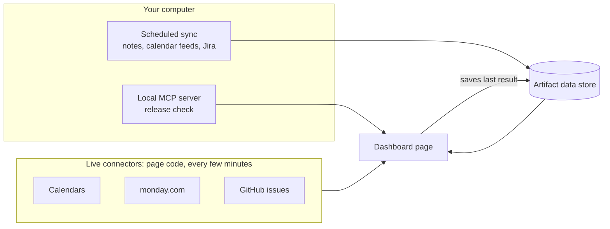

# A Live Work Dashboard

One private page that answers "what needs me today, per client" and keeps
itself current. It shows the day's meetings, the worklist from your notes, and
each client's own tracker, with a filter that narrows everything to one client.

It is a Claude artifact: a hosted page on claude.ai, private until you share
it. The page code calls your connectors and a small data store directly, so
most of it refreshes without any AI run at all.

## What It Shows

- **A summary strip.** Next meeting, today's work as done and open, and one
  figure from the client's own source: release drift, open Jira tickets, open
  GitHub issues, or a backlog count across trackers.
- **Client tiles.** Meetings, open items, high priority, blocked, plus
  tracker counts. Clicking a tile shows only that client; clicking again
  shows all.
- **Tabs.** Worklist (from your notes, top five per client, done items
  hidden), Next 7 days (all calendars, tagged by client), and one tab per
  client tracker. With one client selected, the tabs are named after their
  source: Monday, Release, Jira, GitHub.
- **Release status.** A compact two-column list of repositories that have
  drifted from the release branch, with `↑n` for commits on main not yet
  released. When everything is in sync, a single line with a green dot.

## How Data Reaches the Page

The page can only read what the artifact runtime gives it: your connectors,
its own data store, and MCP servers running on your computer. Everything else
comes through one of three routes, chosen by where the data and its secret
live.



| Route            | Used for                                    | Refresh                                        | Why this route                                            |
| ---------------- | ------------------------------------------- | ---------------------------------------------- | --------------------------------------------------------- |
| Live connector   | Calendars, monday.com, GitHub issues        | Every 2–5 minutes and on "Refresh all"         | The connector signs in as you; no secret reaches the page |
| Scheduled sync   | Notes worklist, `.ics` calendar feeds, Jira | Hourly on weekdays, or on demand from the page | Feed links and API tokens stay in files on your computer  |
| Local MCP server | Release status                              | Every 15 minutes while open in the desktop app | Plain code with your own `gh` login, no AI in the loop    |

## Decisions

1. **Secrets live in local files, never in chat or the page.** Calendar feed
   links and API tokens are bearer secrets. The sync scripts read them on your
   computer and write only event and ticket fields to the data store.
2. **The page saves local results for other devices.** A local MCP server only
   answers when the page is open in the Claude desktop app on that computer, so
   each result is written to the data store and shown elsewhere with its age.
3. **The store is closed to view-only viewers.** Its rule is
   `{ "path": "", "read": "interact", "write": "owner" }`, so sharing the page
   as view-only does not expose the worklist.
4. **Read-only GitHub, enforced twice.** Use a GitHub App you own with only
   Issues: Read on one repository, and connect it to
   `https://api.githubcopilot.com/mcp/readonly` with the request header
   `X-MCP-Toolsets: issues,context`. The app limits what GitHub allows; the
   URL limits what the server offers.
5. **Meetings are tagged by title.** A client without its own calendar is
   picked out of a shared one by keywords in the meeting title, and the same
   meeting seen in two calendars is shown once.

## Set It Up

1. **Copy `sync/` into a folder in your notes vault** (for example
   `_Dashboard Sync/`). Copy each `*.example.json` to its real name and fill
   it in. Keep the real files out of git. `sync_tasks.py` reads a notes file
   laid out as day headings (`### Wednesday 7 October`), client headings
   (`#### **Acme**`) and checkbox items, with later days inside
   `> [!note]- Tomorrow` and `> [!note]- Future` callouts.
2. **Edit the `EDIT:` lines in `dashboard.html`:** client names and title
   keywords, the GitHub repository, the monday.com board, person and column
   ids, and later the scheduled task id.
3. **Ask Claude to publish `dashboard.html` as an artifact** with these
   capabilities, trimmed to the connectors you use:

   ```json
   {
     "mcp": {
       "servers": [
         { "server": "Google Calendar", "tools": ["list_events"] },
         { "server": "Microsoft 365", "tools": ["outlook_calendar_search"] },
         { "server": "monday.com", "tools": ["get_board_items_page"] },
         { "server": "GitHub", "tools": ["list_issues", "get_me"] },
         { "server": "Claude Code Remote", "tools": ["fire_trigger"] },
         { "server": "host:dashboard", "tools": ["release_status"] }
       ]
     },
     "db": { "rules": [{ "path": "", "read": "interact", "write": "owner" }] }
   }
   ```

4. **Create the scheduled sync** as a Cowork scheduled task that needs your
   computer, with the vault folder attached. Its prompt runs the three scripts,
   stages their output, and writes each file to the store with `ArtifactData`
   `set`, pinned to the version it just read. Put its id in `SYNC_TRIGGER`.
5. **Optional: the release check.** Copy `release_state.example.py` to
   `release_state.py` and implement it, then add the server under
   `mcpServers` in the Claude desktop config (Settings → Developer → Edit
   Config) and restart the app:

   ```json
   "dashboard": {
     "command": "/usr/bin/python3",
     "args": ["/path/to/_Dashboard Sync/dashboard_mcp.py"]
   }
   ```

## Pitfalls Seen in Practice

- **A scheduled task without its folder attached reports success and does
  nothing.** Check `folders` on the task, then confirm the store's `syncedAt`
  moved after a run.
- **The desktop app reads local server config only at start.** Quit with
  Cmd+Q and reopen after editing it.
- **macOS ships Python 3.9.** Scripts with `str | None` annotations need
  `from __future__ import annotations` as their first statement.
- **The release check trusts deployment records,** not what actually runs. A
  hand-pushed image or an apply that writes no record shows as drift.

## Files

| File                            | Purpose                                                          |
| ------------------------------- | ---------------------------------------------------------------- |
| `dashboard.html`                | The page, with `EDIT:` markers for your clients and ids          |
| `sync/sync_tasks.py`            | Notes file → worklist items (headline fields only)               |
| `sync/sync_events.py`           | `.ics` feeds → events for the next two weeks                     |
| `sync/sync_jira.py`             | Jira tickets assigned to you that are not done                   |
| `sync/dashboard_mcp.py`         | Local MCP server (stdio, standard library) for the release check |
| `sync/release_state.example.py` | The contract the release check implements                        |
| `sync/*.example.json`           | Config templates for clients, feeds and Jira                     |
