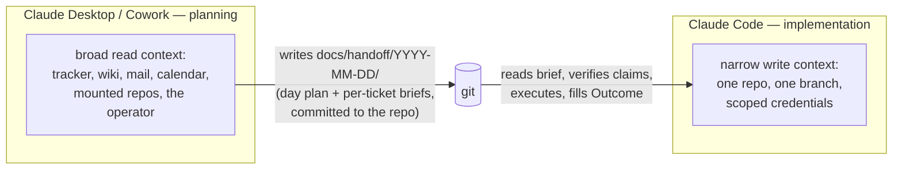

# Planning-to-Implementation Handoff

Plan in Claude Desktop, implement in Claude Code, and connect the two with a
committed dispatch document — because the two sessions share no context, and
because they should not share a machine.

This is the operating model behind the
[handoff plugin](../plugins/handoff/skills/plan-handoff/SKILL.md), the way
[orchestrator-subagent](orchestrator-subagent.md) is the operating model behind
isolated-agent security. Read that one too; this practice is the cross-machine
version of the same split.

## The Shape

The planning session reads widely: the issue tracker, wiki pages, the repo's
`CLAUDE.md` and rules, the master plan, and the operator's head. It produces a
day plan (ordering, gates, risks with confidence levels) and one self-contained
brief per work unit, committed under `docs/handoff/` on a ticket-keyed branch.

The implementation session reads narrowly: the day plan, its assigned brief, and
the repo itself. It executes, fills in the brief's Outcome section, and promotes
durable evidence out to the tracker. The brief is the dispatch record; the
tracker and the PR are the audit record.

## Reading Context, in Order

A planning session that skips context produces briefs that are confidently
wrong. Read in this order before writing anything:

1. **The repo's own instructions** — `CLAUDE.md`, `.claude/rules/`, and any
   existing `docs/handoff/` contract. These override everything below.
2. **The master plan or roadmap** — so the day's work is placed against the
   critical path, and pulling work forward is a stated decision, not an
   accident.
3. **The tracker** — ticket state, dependencies, what closed since the plan was
   last touched. Treat tracker status as a claim, not a fact: PR state is the
   truth for "is it done".
4. **What could not be verified** — write it down with a confidence level. A
   planning session usually has connector gaps (an unauthenticated integration,
   an ungranted tenant). Naming the gap in the day plan turns it into the
   implementation session's first verification step instead of a silent
   assumption.

## Why Separate, Dedicated Instances

The split is not ceremony; each side's posture is wrong for the other's job.

- **Security.** The planning instance holds broad, human-scoped access: mail,
  calendar, wiki, tracker, several repos. The implementation instances hold
  narrow, per-client credentials on dedicated machines — one client, one
  instance, no cross-contamination. A prompt-injection or exfiltration incident
  on a code agent is contained to that instance's scope. See
  [isolated-agent security](../security/isolated/README.md).
- **Autonomy.** Implementation instances run 24/7 and are disposable; a
  committed brief survives any crash, restart, or reprovision. The planning
  session is interactive and ends when the operator walks away. Anything that
  must outlive the conversation goes in the brief — that constraint is the
  whole design.
- **Auditability.** Every dispatch is a commit; every outcome is a PR plus a
  tracker comment. Reconstructing "what was asked and what happened" needs git
  history, not chat history.

## The Contract

The brief format, status lifecycle (Draft → Dispatched → Consumed → Archived),
staleness rules, and evidence promotion are specified once in the
[plan-handoff skill](../plugins/handoff/skills/plan-handoff/SKILL.md) and, per
repo, in `.claude/rules/handoff.md` so implementation sessions auto-load it.
Two rules do most of the work:

- **Self-containedness.** Could a session with no other context execute this
  brief? If it needs the planning conversation, it is incomplete.
- **Verify before trusting.** Everything a brief says about the world (PR
  states, deployments, credentials) is a snapshot from its header date. The
  consuming session re-verifies before acting.

## Relation to goal:plan / goal:execute

The [goal plugin](../plugins/README.md) solves the adjacent problem: agreeing a
Definition of Done and executing to it within one initiative, with separate
author and reviewer identities. A handoff brief can point at a goal plan as its
"Steps" section for larger work units. Handoff is the transport between
machines; goal is the contract for the work itself.
