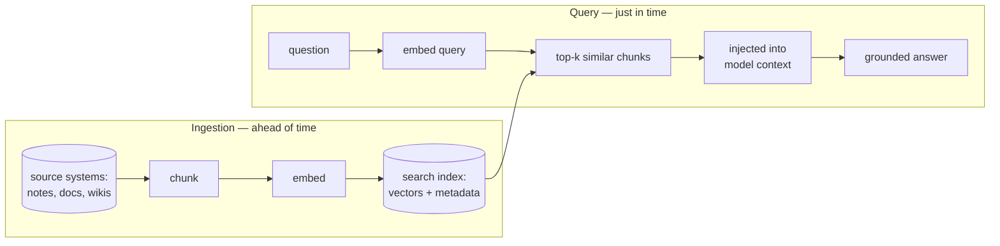
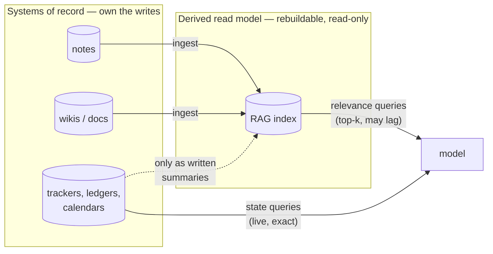
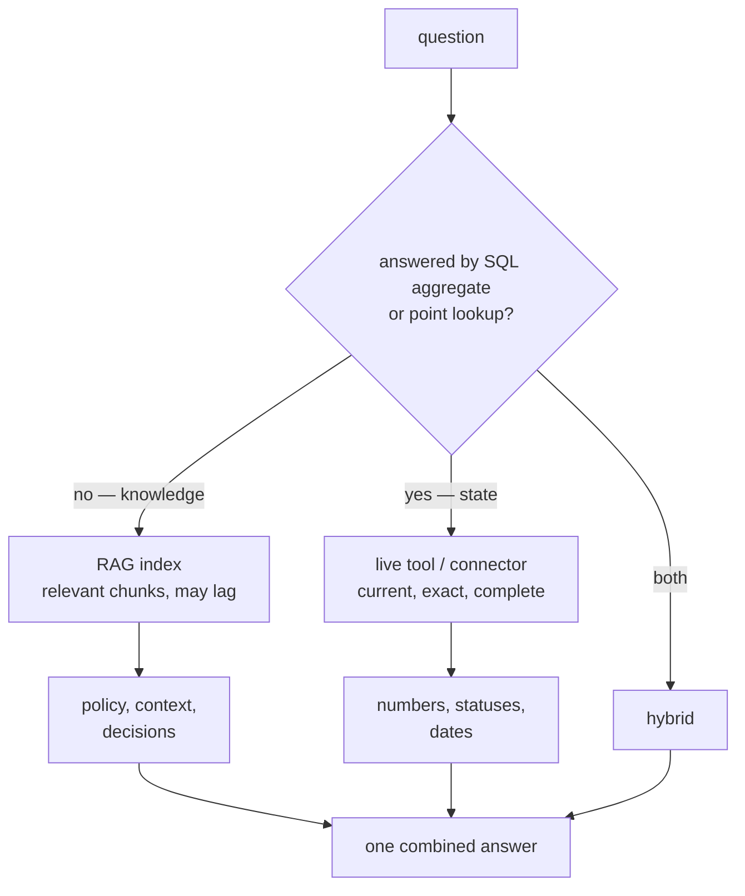

# Retrieval (RAG)

How to think about retrieval-augmented generation: what it is, the mental
model that predicts when it works, and the boundary where it stops fitting.
The implementation this practice drives lives in
[packages/rag/DESIGN.md](../../packages/rag/DESIGN.md).

## What RAG is

An ingestion pipeline pulls documents from source systems, splits them into
chunks, converts each chunk to an embedding vector, and stores vectors plus
metadata in a search index. At question time the query is embedded, the index
returns the most semantically similar chunks, and those chunks are injected
into the model's context as retrieved text — just-in-time, per conversation.
The model never "contains" the data; it reads the snippets it was served.

Two properties follow. Content with no API becomes searchable (notes, file
shares, exported documents). And the context footprint stays small no matter
how large the corpus grows, because only the relevant chunks travel.

## The mental model: a BI layer for AI

Treat a RAG index the way you treat a data warehouse, not the way you treat a
database. It is a **derived read model over systems of record**:

- **Fed by ingestion.** Sources remain the truth; the index is a projection.
- **Eventually consistent.** The index lags the source. For knowledge that is
  acceptable; it is the price of the layer.
- **Rebuildable.** Delete the index, re-run ingestion, and it comes back.
  Derived data needs repair semantics (idempotent re-runs), not backup
  semantics.
- **Read-only.** Nothing writes to it except the pipeline. Writes belong to
  the source systems.

One refinement keeps the analogy honest: a warehouse answers **aggregate**
questions over structured facts ("total by quarter"); a RAG index answers
**relevance** questions over text ("what do we know about X", "what did we
decide about Y"), returning the top-k most similar chunks — never a complete
or exact result set. So: fed like a warehouse, queried like a search index.

## Where it stops: transactional data

State does not fit RAG, for three independent reasons:

1. **Staleness.** "What is the current balance", "is this task open", "what
   is on the calendar" need current state. An index is always behind — wrong
   answers, delivered confidently.
2. **Precision and completeness.** "Sum of all unpaid invoices" needs every
   matching record, exactly. Top-k similarity gives the ten most
   similar-looking chunks; an aggregate over that is meaningless. There is no
   `SUM()` over embeddings.
3. **No write path.** Transactions mutate state; a RAG index has no writes by
   design.

The rule of thumb: **if a question could be answered by a SQL aggregate or a
point lookup, it is a live tool call; if it is answered by "reading the
relevant documents", it is RAG.** Calendars, task boards, and ledgers stay
behind live APIs and connectors; notes, policies, and decisions go in the
index.

Two refinements:

- **The hybrid is the normal case.** "Can I expense this?" retrieves the
  expense policy from the index and fetches current spend from the finance
  API, and the model combines them. Retrieval and live tools cooperate per
  question.
- **Transactional data can enter as documents, not records.** A written
  monthly summary or an incident post-mortem is knowledge derived from
  transactions — index the narrative, never the ledger. Chunking rows is the
  signal you wanted a tool instead.

If CQRS is familiar: the index is a materialized read model specialized for
semantic queries. Rebuildability, lag tolerance, and one-way data flow all
follow from that.

## When not to build RAG at all

Sources with a good live API — issue trackers, calendars, mail, project
boards — are often better served by their existing connectors or MCP tools:
live, permission-aware, zero pipeline to own. RAG earns its place for content
with no API, and for semantic search across sources that no single connector
can answer. Build the pipeline where those hold; reuse connectors where they
do not.
